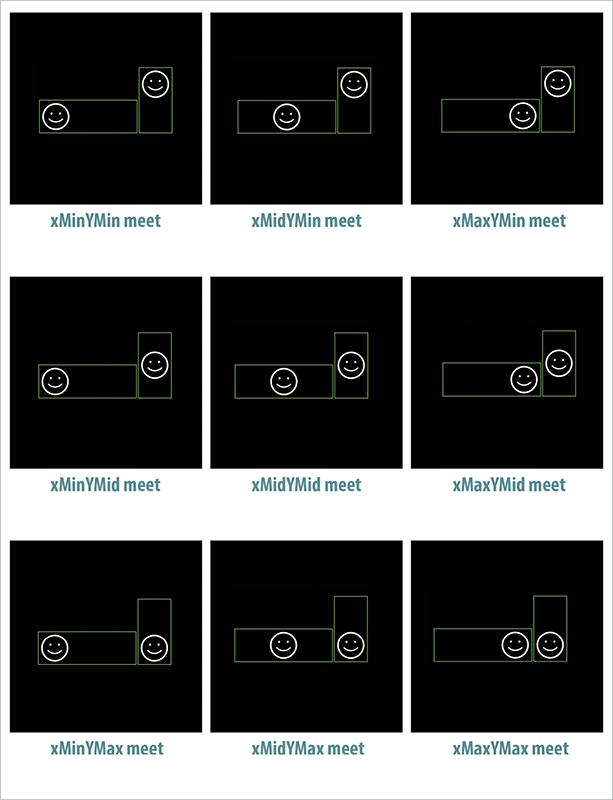
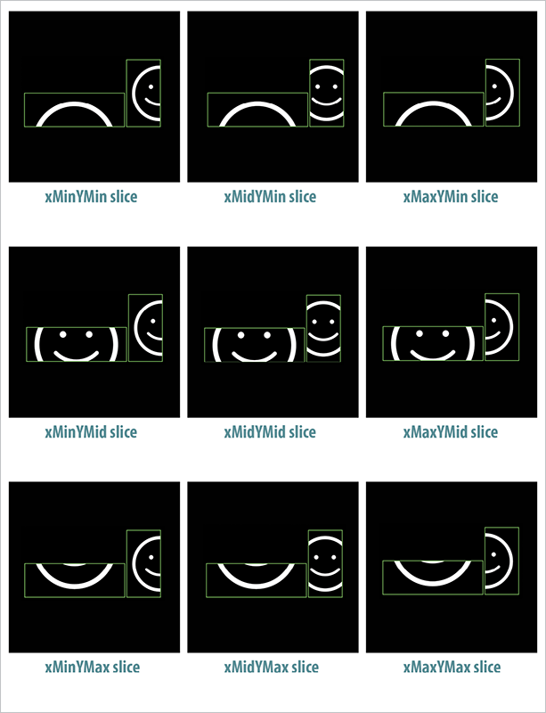
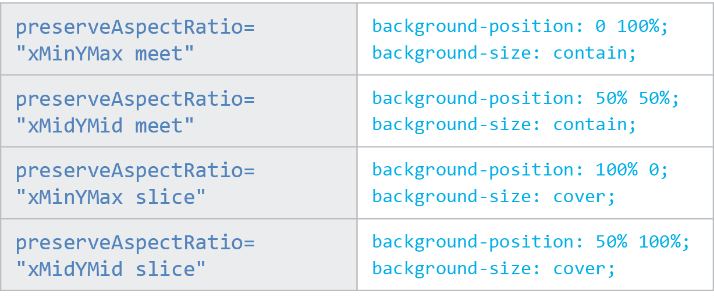
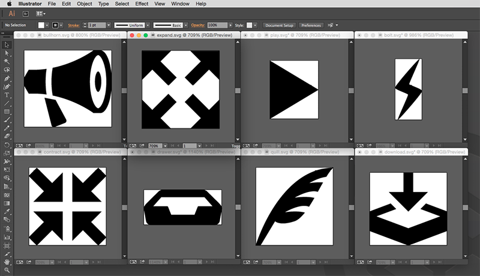
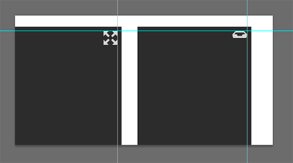
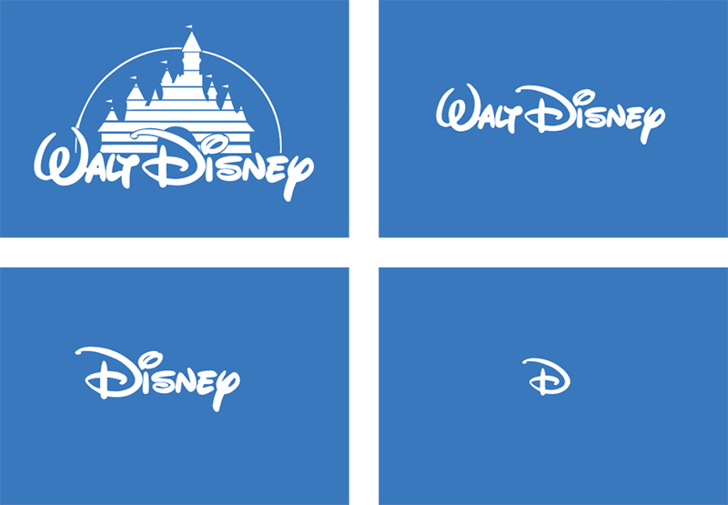
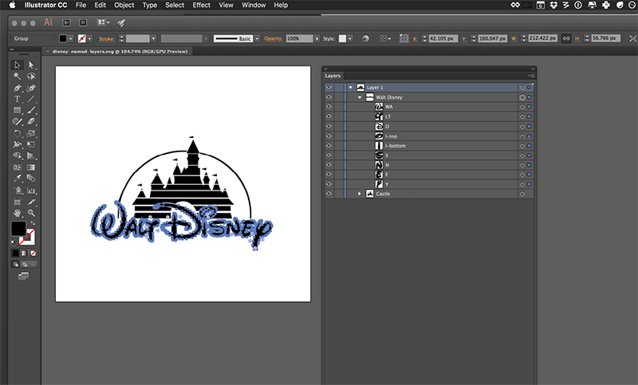

YOU’LL PROBABLY WANT to exert some sizing control over any graphic you put on a website. _Hey! You! Logo! You should be this size:_

```

```

```
.logo {
  width: 220px;
  height: 80px;
}
```

And so shall it be.

But if the element you are resizing happens to be `svg`, the result might not be exactly what you expect. Sizing `svg` is a little more complicated than sizing an `img`. I’m not saying this to scare you. It’s almost complicated in a _good_ way, because it gives you more control and opens up some interesting possibilities.

Keep these two concepts in mind when you’re working with the size of SVG images:

- The viewport is simply the height and width of the element: the visible area of the SVG image. It’s often set as `width` and `height` attributes right on the SVG itself, or through CSS.
- The `viewBox` is an attribute of `svg` that determines the coordinate system and aspect ratio. The four values are `x`, `y`, `width`, and `height`.

Say we’re working with some SVG like this:

```
<svg width="100" height="100" viewBox="0 0 100 100" ... >
<!-- alternatively: viewBox="0, 0 100, 100" -->
```

In this case, the viewport and `viewBox` are in perfect harmony (FIG 6.1). The SVG will be drawn in the exact area it visually occupies.

, or if you do, they match the aspect ratio of the viewBox.")

Now say we double the width and height, like this:

```
<svg width="200" height="200" viewBox="0 0 100 100" ... >
```

Will the `svg` just draw in a 100 by 100 space in the upper left side of the 200 by 200 element? Nope. Everything inside the `svg` will scale up perfectly to be drawn in the new, larger space (FIG 6.2).


The square aspect ratio still matches perfectly. That’s why it’s not particularly useful to think of the numbers anywhere in SVG as pixels, because they aren’t pixels; they’re just numbers on an arbitrary coordinate system.

What if the aspect ratios don’t match, though?

```
<svg width="300" height="75" viewBox="0 0 100 100" ... >
```

What happens now, by default, is that the SVG will draw itself as large as it can, centered along the longest dimension (FIG 6.3).


If you want to regain some control over this behavior, there’s an attribute for the `svg` element that can help!

## preserveAspectRatio

It looks like this:

```
<svg preserveAspectRatio="xMaxYMax" ... >
```

The `x` and `Y` parts of that value are followed by `Min`, `Mid`, or `Max`. The reason SVG normally centers in the viewport is because it has a default value of `xMidYMid`. If you change that to `xMaxYMax,` it tells the SVG: _Make sure you go horizontally as far to the_ _right as you can, and vertically as far to the_ _bottom as you can. Then be as big as you_ _can be without cutting_ _off_.



The “without cutting off” part is another aspect of `preserveAspectRatio`. The default value is `xMidYMid` `meet`—note the “meet.” You can replace `meet` with `slice` to say instead: _Fill the area entirely; cutting off is okay_.

There are nine possible alignment values combined with `meet` (FIG 6.4).

There are also nine possible alignment values combined with `slice` (FIG 6.5).

I made a testing tool for playing with this idea ([http://bkaprt.com/psvg/06-01/](http://bkaprt.com/psvg/06-01/)). Sara Soueidan also wrote an in-depth article on this subject, where she makes an excellent observation relating this idea to CSS ([http://bkaprt.com/psvg/06-02/](http://bkaprt.com/psvg/06-02/)). The `background-size` property has two keywords it can take: `contain` and `cover`. The `contain` value means “make sure this entire image is viewable, even if you have to shrink it,” which makes it just like `meet`. The `cover` value means “make sure this covers the entire area, even if you have to cut parts off,” which makes it just like `slice`.

Even the alignment part of the value has a matching CSS counterpart: `background-position`. The default `background-position` is `0 0`, meaning “top left.” That’s just like `xMinYMin`. If you were to change that to, say, `50% 100%`, that would be like `xMidYMax`!

FIG 6.6 has some examples to make that connection a little clearer.

Remember: these aren’t interchangeable bits of code; they are just conceptually related.



What if you want to throw aspect ratio out the window and have SVG scale to the viewport, like a raster image would? Turn `preserveAspectRatio` off (FIG 6.7)!

```
<svg preserveAspectRatio="none" viewBox="0 0 100 100">
```


Amelia Bellamy-Royds wrote a comprehensive article on scaling SVG, in which she covers things like the fact that `svg` can essentially contain other `svg` with different aspect ratios and behavior, so you can make some parts of an image scale and others not, which is pretty cool and unique to SVG ([http://bkaprt.com/psvg/06-03/](http://bkaprt.com/psvg/06-03/)).

### Approaches to artboard sizing

When you draw SVG in editing software, that software likely gives you some kind of artboard to draw on. That’s not a technical SVG term; it’s essentially a visual metaphor for `viewBox`.

Let’s say you’re working with a whole set of icons for a site. One approach is to make all artboards hug each edge of the icon (FIG 6.8).

Here’s a quick trick to get that artboard cropping in Illustrator: select the Artboard tool and then “Fit to Artwork Bounds” from the Presets menu (FIG 6.9).



The big advantage to this technique is alignment (FIG 6.10). If you want to align any edge of any of these icons to anything else, that’s easy to do. There is no mysterious space you need to contend with, or tweaky positional CSS.

```
.icon.nudge {
  position: relative;
  right: -2px; /\* UGHCKKADKDKJ \*/
}
```



The big disadvantage to the cropping technique is relative sizing. Imagine you take the practical step of sizing your icon’s width and height, like this:

```
.icon {
  width: 1em;
  height: 1em;
}
```

A tall, skinny icon will shrink to fit in that space and potentially appear awkwardly small. Or perhaps you’re trying to have an intentionally small star shape as an icon, except the star has a squarish aspect ratio and thus grows to fill the space, appearing bigger than you want it to.

Here’s an example where two icons are sized identically as a square (FIG 6.11). The “expand” icon looks right at home, since it has a square aspect ratio to match. But the “zap it” icon has a tall and narrow aspect ratio, so it looks wimpy, like it’s floating in the same square area.


The other approach here is to make consistently sized artboards (FIG 6.12).


The advantages and disadvantages are exactly inverse here. You might have alignment issues, because not all edges of the icons touch the edge of the `viewBox`, which can be frustrating and might require tweaking sometimes (FIG 6.13).


You won’t have relative sizing issues, though, because the `viewBox` is the same for all of them. If any particular icon looks too big or small, you can adjust the artwork to bring it more in line with the set.

Since we’re learning about sizing, now is the perfect time to bring up how SVG fits into the flexible world of responsive design.

## RESPONSIVE SVG

One of the hallmarks of responsive design is fluid layout. Content—images included—is designed to fit its containers and the screen. If responsive design is new to you, Ethan Marcotte’s seminal 2010 article on the subject is a fine place to start learning about it ([http://bkaprt.com/psvg/06-04/](http://bkaprt.com/psvg/06-04/)). SVG jibes extremely well with responsive design:

- Responsive designs are flexible. So is SVG! It renders well at any size.
- Responsive web design is a philosophy of caring about how a website looks and behaves in any browser. Comparatively smaller SVG files and performance-responsible tactics like an SVG icon system can be a part of that.

But perhaps SVG’s most obvious connection to responsive design is the possibility to react to CSS `@media` queries. Media queries move, hide, or show elements with CSS based on things like the width or height of the browser window. Those elements can be anything: sidebars, navigation, ads, what have you. They can be SVG elements as well.

Imagine a logo that displays different levels of detail depending on how much space is available. That’s exactly what Joe Harrison was thinking when he created a really neat demo using well-known logos ([http://bkaprt.com/psvg/06-05/](http://bkaprt.com/psvg/06-05/), FIG 6.14).



On the web, we’ve always had the ability to swap out images with other ones. What’s appealing here is that we aren’t _swapping_ _out_ images; these are all the _same_ image. Or at least they could be. That signature “D” all by itself could be the same exact “D” used in the most complex version of the logo. Easy-cheesy in CSS.

Say we organize the SVG like so:

```
<svg class="disney-logo">
  <g class="magic-castle">
    <!-- paths, etc -->
  </g>
  <g class="walt">
    <!-- paths, etc -->
  </g>
  <g class="disney">
    <path class="d" />
    <!-- paths, etc -->
  </g>
</svg>
```

This, by the way, is pretty easy to do in Illustrator (FIG 6.15). The groups and names you create there turn into IDs in the SVG output, and you can use those IDs to do the styling. Personally, though, I prefer using classes because they aren’t unique (so you don’t accidentally end up with multiple identical IDs on the page) and because classes have a lower and more manageable level of CSS specificity. It’s easy enough to change IDs to classes with a bit of find-and-replace maneuvering in a code editor.



The corresponding CSS could be something like this:

```
@media (max-width: 1000px) {
  .magic-castle {
    display: none;
  }
}
@media (max-width: 800px) {
  .walt {
    display: none;
  }
}
@media (max-width: 600px) {
  .disney > *:not(.d) {
    display: none;
  }
}
```

Mind you, this is a contrived example of hiding parts of the images at different breakpoints, but that’s exactly how you would do it, along with some likely sizing adjustments. Anything you can do with CSS is on the table here. Perhaps some animation is appropriate at some breakpoints but not at others. Perhaps you change stroke sizes to beef up or trim down icons at different sizes. Perhaps you change some fill colors to simplify adjacent shapes.

And things can get even fancier! Depending on how the SVG is used, those media queries might actually be different. SVG used as `img`, `iframe`, or `object` has its own viewport. That means CSS _embedded inside of it_ reacts to media queries based on that, rather than the whole browser window viewport. That means you would write, say, width-based media queries based on the width of the image, not of the entire page.

That’s a very appealing idea: an element that arranges itself based on attributes of itself, rather than the page. _Am I this wide? Do this. Am I this tall\*\*? Do this._ That way, the SVG reacts to the situation it’s in rather than the arbitrary document it happens to be part of.

As I write, this is referred to as “element queries” in CSS, but it doesn’t actually exist yet in regular HTML/CSS. Once again, SVG is ahead of the curve.

## GRADUATION INTO ANIMATION

Speaking of things SVG is good at, let’s move into animation next. Everything we have been building on so far has prepared us for this. Hang on tight!
