BEYOND DRAWING and animating shapes, SVG has several features that can alter how the image ends up looking. We’ll review four of them.

## FILTERS

You may already know that CSS has filters. For instance:

```
.grayscale-me {
  filter: grayscale(100%);
}
```

SVG probably looks at those and is like: “Cute, kid.” SVG filters are the original gangsters of filters. A similar filter defined in SVG would look like this:

```
<filter id="grayscale">
  <feColorMatrix type="saturate" values="0" />
</filter>
```

You can then apply that via CSS like so:

```
.grayscale-me {
  filter: url("#grayscale"); /\* space separate   multiple filters \*/
  /\* or in an external file \*/
  filter: url("filters.svg#grayscale");

  /\* you could even use a data URI here! \*/
}
```

Or you can apply it to an SVG element, like this:

```
<g filter="url(#grayscale)">
  <!-- grayscale all the stuff in here -->
</g>
```

With a filter like that available, it would be easy to design an interaction where, for instance, there is a grid of Adorable Avatars in grayscale; the one being hovered over or tapped goes back to full color, as shown in FIG 8.1 ([http://bkaprt.com/psvg/08-01/](http://bkaprt.com/psvg/08-01/)).

```
img {
  filter: url("#grayscale");
}
img:hover, img:focus {
  filter: none;
}
```

While CSS filters may be a bit easier to use, SVG filters can do anything that CSS filters can, and with deeper browser support.


The practical stuff, like blur, is all there in SVG filters (FIG 8.2):

```
<filter id="blur">
  <feGaussianBlur in="SourceGraphic" stdDeviation="3" y="-"/>
</filter>
```


But things can quickly get complex. Here’s the “color matrix” required for converting colors to sepia tone (FIG 8.3):

```
<filter id="sepia">
  <feColorMatrix type="matrix" values=".343 .669   .119 0 0 .249 .626 .130 0 0 .172 .334 .111 0 0   .000 .000 .000 1 0" />
</filter>
```


Or something really weird and otherworldly, like adding “turbulence” (FIG 8.4):

```
<filter id="turbulence" >
  <feTurbulence type="fractalNoise"   baseFrequency="0.015" numOctaves="2"   result="turbulence\_3" data-filterId="3" />
  <feDisplacementMap xChannelSelector="R"   yChannelSelector="G" in="SourceGraphic"   in2="turbulence\_3" scale="65" />
</filter>
```


And we’re just getting our toes wet. Note how the turbulence filter included two filter operations. Filters can include any number of operations, each affecting the last. As Chris Lilley told me in an email: “In some ways \[filters\] are more like a flow-based programming language than markup.”

Lucas Bebber built some beautiful “Gooey Menus” with SVG filters that are fun to explore ([http://bkaprt.com/psvg/08-02/](http://bkaprt.com/psvg/08-02/)). They combine blurring and deblurring and shadowing and compositing and all kinds of fancy.

There is practically no limit to what SVG filters can do to graphics. If this appeals to you, I’d encourage you to check out the spec ([http://bkaprt.com/psvg/08-03/](http://bkaprt.com/psvg/08-03/)).

## PATTERNS

Patterns are repeated designs. Imagine a polka-dot dress or those baggy chef pants with all the little different kinds of peppers on them that you used to wear in middle school and oh god the loneliness. Nobody laid out every single polka dot or pepper; they were created from patterned fabric.

Here are two reasons SVG patterns are cool:

- They make quick work of designs that would otherwise be too complex (too many points; too big a file).
- They are made from other chunks of SVG!

Imagine a repeating site background (FIG 8.5). _Very nice_, you think to yourself, _but can I use SVG for that_? It seems like an awful lot of vector points; the file size is probably too big to be practical. That would be an understandable thought, but this file is only about one kilobyte. That’s because we made that complex-looking pattern from one tiny little shape (FIG 8.6).

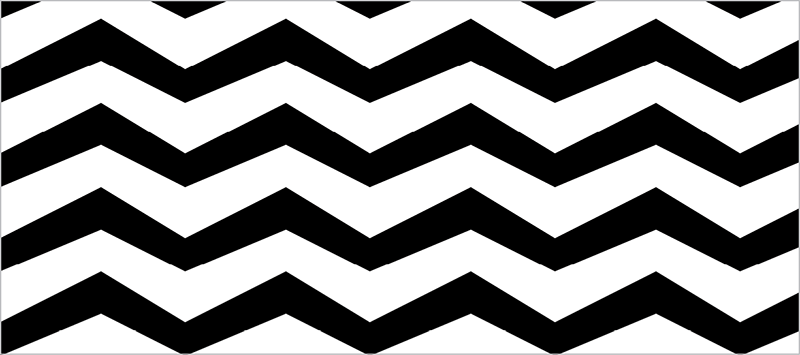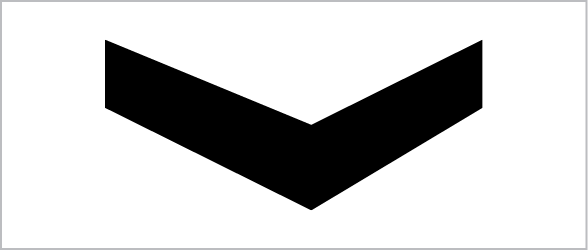

The `pattern` element provides the magic here. It’s an element designed to be used as a fill that will repeat over and over in a grid, like CSS `background-image`s can. A `pattern` is essentially a `rect`. It takes the same attributes: `x`, `y`, `width`, and `height`. The difference is that it doesn’t render all by itself, just like the `symbol` element we used back in Chapter 3! You give it an ID so other elements can reference it.

Any SVG element that _does_ render can use the `pattern` as a `fill`. Here, let’s fill the entire SVG area with circles:

```
<svg width="100%" height="100%">

  <!-- this rectangular area won’t render,
       but anything drawn inside of it can
       be used to fill other shapes -->
  <pattern id="pattern-circles"   x="0" y="0" width="20" height="20"   patternUnits="userSpaceOnUse">
    <circle cx="10" cy="10" r="10" fill= "#f06d06" />
  </pattern>
    <rect x="0" y="0" width="100%" height="100%" fill="url(#pattern-circles)" />

</svg>
```

Note the `patternUnits="userSpaceOnUse"` on the `pattern` element. That ensures that both the pattern and the element using the pattern exist in the same coordinate system (`x`, `y`, `width`, and `height`). In my experience, this prevents a boatload of confusion. If you ever find yourself in a situation where you want a `pattern` to have its own new coordinate system, look into the `objectBoundingBox` value for the `patternUnits` and `patternContentUnits` attributes.

In FIG 8.7, the circle repeats perfectly, just touching the next circle in the pattern. That’s because the width of the circle (radius × 2) and width of the pattern rectangle are exactly the same. And the circle is positioned in the middle of that pattern rectangle.

.")

What if we move the center of the circle to `0,0`? Then we’ll only see the bottom right corner of the circle, because that’s the only part of it that’s visible within the pattern rectangle. Anything outside of that area is cut off (FIG 8.8).


Or say we increase the radius of the circle beyond the edges, and position it centered at the top. Our pattern might then resemble curtains (or waves) (FIG 8.9).

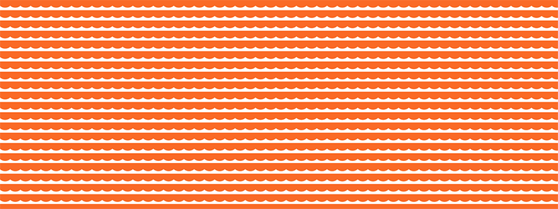

I’ve set up a playground for playing around with these `pattern` attributes ([http://bkaprt.com/psvg/08-05/](http://bkaprt.com/psvg/08-05/)).

Illustrator has a pretty good tool for working with patterns, and thankfully it also saves to SVG well! If you go to Object > Pattern > Make, the Pattern Options panel will open, and the interface will shift into pattern-editing mode (FIG 8.10).

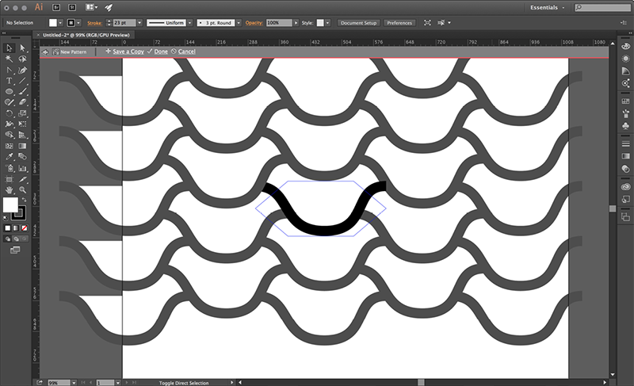

First you make the pattern (click Done at the top of the screen when you have it how you want it); then Illustrator makes a new “swatch” for this pattern under the Swatches panel. Now you can create or select other elements and apply this pattern to them, just like you would in the SVG syntax with `fill="url(#pattern)"`.

What is especially useful about working with patterns in Illustrator is that we aren’t limited to the repeating rectangles. You can define a pattern with offset rectangles (like a brick wall) or a grid of hexagons. This opens up some pretty cool pattern opportunities (read: almost any design set in repeating hexagons looks cool). SVG still only supports repeating rectangles through `pattern`, but that’s precisely what is wonderful about Illustrator: it does the hard work for you of converting that pattern to one that can be represented as a rectangular tile, such that it can be drawn with `pattern`.

You probably know you can create repeating patterns in CSS as well. In fact, the default is `background-repeat: repeat`. You can simply create a rectangular bit of SVG and repeat it that way, which is a pretty great option if you’re already using the pattern as a background. Otherwise, in order to set other content on top of the pattern set in inline SVG, you’d have to position it into place on top using `position: absolute;`—a rather blunt tool for the job.

If you’d like to play around more with `pattern`, SVGeneration is a pretty neat site for that, providing patterns that make use of features unique to SVG, as well as a UI to customize them and show you the code ([svgeneration.com](http://www.svgeneration.com/)).

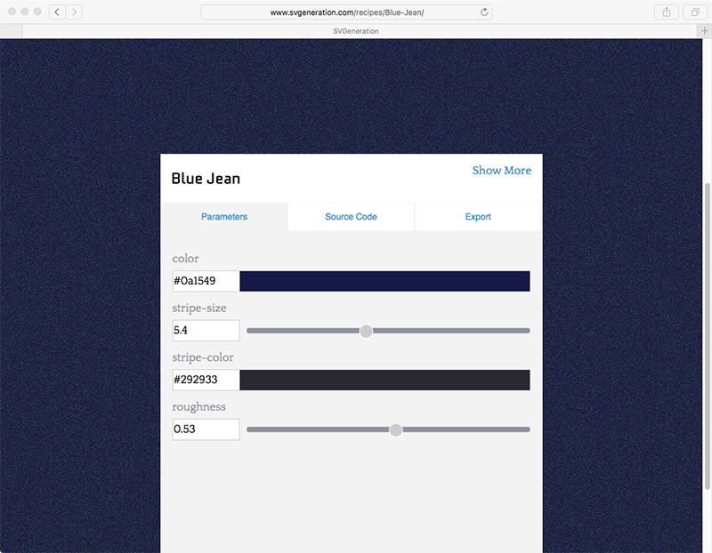

## CLIPPING AND MASKING

Clipping and masking are related concepts because they are both capable of hiding parts of an image. But the distinction between them can be confusing, so let’s clear that up right now:

- Clipping is created from vector paths. Anything outside the path is hidden; anything inside is shown.
- Masking is created from images. Black parts of the image mask hide; white parts show through. Shades of gray force partial transparency—imagine a black-to-white gradient over an image that “fades out” the image.

Clipping is done with the `clipPath` element. Any SVG elements you put inside of the element don’t render all by themselves (again, like `symbol`), but can be applied to other elements to clip them.

Let’s say we have a `polygon` of a star shape (FIG 8.12). And we also have a bunch of other fun SVG shapes laid out (FIG 8.13). We can use the star shape as a clipping path for the circle shapes (FIG 8.14):

```
<svg viewBox="0 0 1200 1000">
  <defs>
     <clipPath id="clip-star">
       <polygon points="..." />
     </clipPath>
  <defs>
  <g clip-path="url(#clip-star)">
    <circle ... />
    <!-- all those cool circles -->
  </g>
</svg>
```

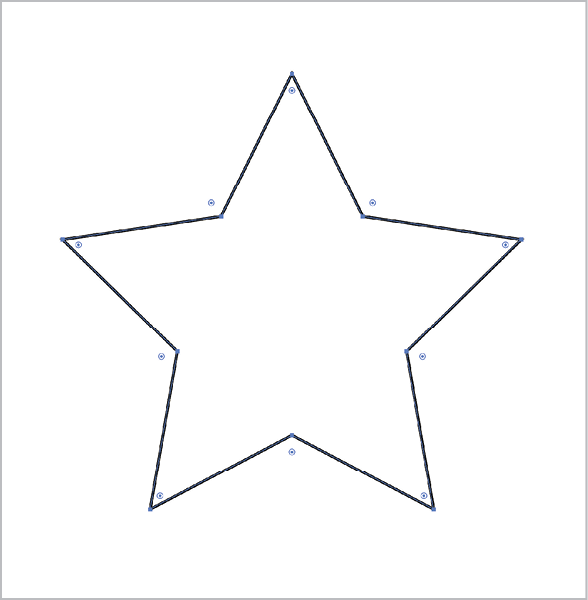

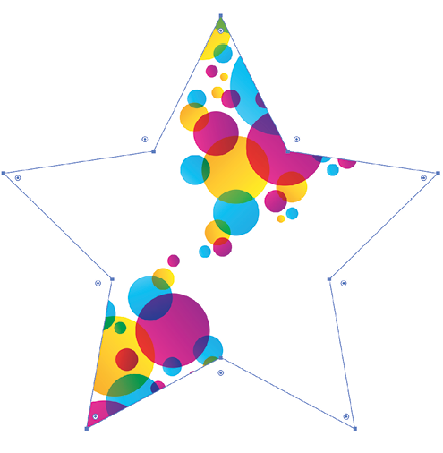

FIG 8.14: The star shape being used as a `clipPath` for the `circle`s.

In Illustrator, you can apply clipping paths like this by selecting multiple elements, making sure the topmost element is the clipping path you want to apply, and going to Object > Clipping Mask > Make. Note that Illustrator calls it a “mask” here, but it’s actually a clipping path.

A clipping path is black and white in the sense that the part of the image being clipped is either hidden entirely or shown entirely. A mask is a bit different. A mask covers the entire area with an image of its own. Where that masking image is black, it _hides_ the image below (and prevents user interaction as well, a sort of `pointer-events: none;`). Where that masking image is white, it _reveals_ the image below. Any grays in that masking image partially reveal the image, depending on their value.

Perhaps the easiest way to make this distinction is to picture a white-to-black gradient (FIG 8.15).This gradient can be created in SVG and applied to a `rect`, and then put inside a `mask` element. If we apply that `mask` to the same fun circles we were working with before, we get some nice results (FIG 8.16).


The code looks like this:

```
<svg viewBox="0 0 1200 1000">
  <mask maskUnits="userSpaceOnUse" id="fade">
    <linearGradient id="gradient" x1="0" y1="0"     x2="0" y2="100%">
      <stop offset="0" style="stop-color: #FFFFFF" />
      <stop offset="1" style="stop-color: #000000" />
    </linearGradient>
    <rect fill="url(#gradient)" width="100%" height="100%" />
  </mask>
  <g mask="url(#fade)">
    <circle ... />
    <!-- all those cool circles -->
  </g>
</svg>
```

FIG 8.17 shows a photographic image applied as a mask, yielding a pretty wild outcome. A mask lets you do the same thing a clipping path does: you can fill the shapes you make with black or white as needed, and you can reverse the mask by simply reversing the colors. But masks are a bit more flexible—unlike clipping paths, masks can do partial masking.


Masks have another distinctive feature: they have two different types. We already looked at the default, `mask-type="luminance"`, which is based on color. There’s another one: `mask-type="alpha"`. Alpha masks don’t take color into account, only the alpha channel itself. For instance, if you use an SVG element as part of a mask with no fill at all, that’s considered fully alpha transparent and will show the image beneath ([http://bkaprt.com/psvg/08-06/](http://bkaprt.com/psvg/08-06/)).

You can use raster images as masks if you want (FIG 8.18):

```
<mask maskUnits="userSpaceOnUse" id="fade" mask-type="alpha">
  <image y="200" width="100%" height="500"   xlink:href="alpha-mask.png" />
</mask>
```

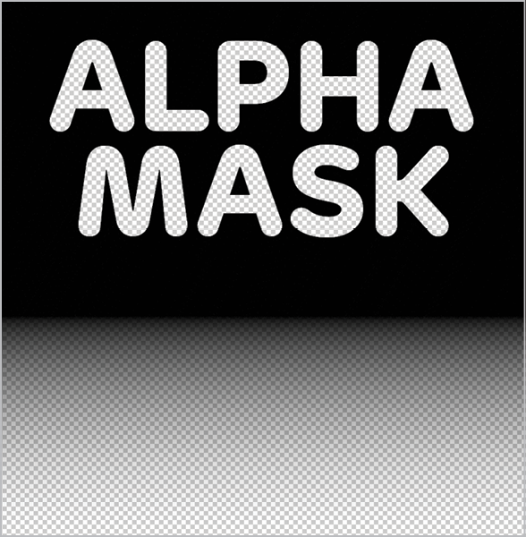

Peter Hrynkow has a very clever technique utilizing SVG masks ([http://bkaprt.com/psvg/08-07/](http://bkaprt.com/psvg/08-07/)). Say you want a photographic image, and JPG is the best choice in terms of file size and quality. But you also want alpha transparency around the edges of the subject in the photograph. You could save from Photoshop as a “PNG-24,” but then the file size will be a lot bigger than it would be with JPG.


Hrynkow’s solution is to use two images. The photograph, and a black-and-white image as the mask. Then apply that mask in inline SVG!

<svg viewBox="0 0 560 1388">

```
  <defs>
    <mask id="canTopMask">
      <image width="560" height="1388"       xlink:href="can-top-alpha.png"></image>
    </mask>
  </defs>
  <image mask="url(#canTopMask)" id="canTop"   width="560" height="1388" xlink:href=  "can-top.jpg"></image>
</svg>
```

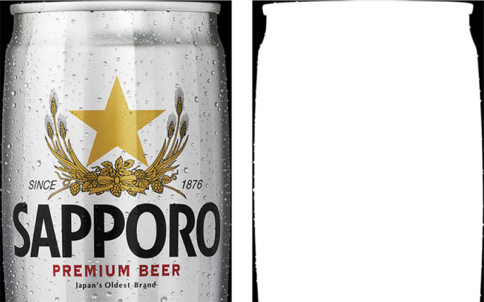

## BEYOND BASIC FILLS AND STROKES

Fills can be, and often are, solid colors: `fill="#F06D06"`, `fill="rgba(255,0,0,0.6);"`, and the like. But a fill can also be a gradient, much like how in CSS a background can have a solid color or a gradient as part of `background-image`. Using the same syntax you would use if you were applying a pattern fill, you reference the ID of where you have defined the gradient:

<path fill="url(#id)" ... >

Here’s the definition for a lovely rainbow gradient from a Pen by yoksel ([http://bkaprt.com/psvg/08-08/](http://bkaprt.com/psvg/08-08/)):

```
<linearGradient id="MyGradient" x1="0" y1="0" x2="100%" y2="0%">
  <stop offset="0%" stop-color="crimson" />
  <stop offset="10%" stop-color="purple" />
  <stop offset="10%" stop-color="red" />
  <stop offset="20%" stop-color="crimson" />
  <stop offset="20%" stop-color="orangered" />
  <stop offset="30%" stop-color="red" />
  <stop offset="30%" stop-color="orange" />
  <stop offset="40%" stop-color="orangered" />
  <stop offset="40%" stop-color="gold" />
  <stop offset="50%" stop-color="orange" />
  <stop offset="50%" stop-color="yellowgreen" />
  <stop offset="60%" stop-color="gold" />
  <stop offset="60%" stop-color="green" />
  <stop offset="70%" stop-color="yellowgreen" />
  <stop offset="70%" stop-color="steelblue" />
  <stop offset="80%" stop-color="skyblue" />
  <stop offset="80%" stop-color="mediumpurple" />
  <stop offset="90%" stop-color="steelblue" />
  <stop offset="90%" stop-color="purple" />
  <stop offset="100%" stop-color="mediumpurple" />
</linearGradient>
```

We can apply that to a `path` or any other basic shape, but we can also apply it to `text` (FIG 8.21). It produces that cool knockout effect that is difficult to pull off cross-browser with CSS.

. The brusque changes result from stops with the same offset, such as red to orange (30%) or gold to green (60%).")

Another cool thing you can do in SVG that you can’t do as intuitively in CSS is apply a fill to a stroke. Another Pen by yoksel demonstrates this beautifully ([http://bkaprt.com/psvg/08-09/](http://bkaprt.com/psvg/08-09/), FIG 8.22).

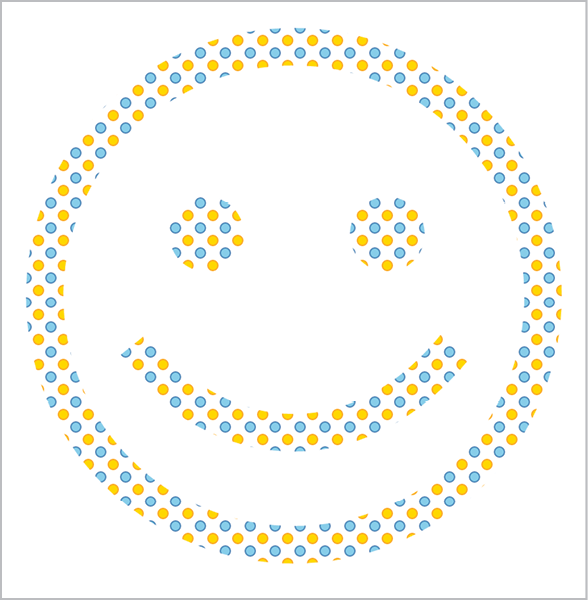

Those are nice thick `stroke-width="30"` strokes there!

## COMBINING FEATURES

These features of SVG aren’t mutually exclusive and, in fact, combining them is great fun. For example, you can animate a clipping path:

```
<svg id="drawing" viewBox="0 65.4 792 661.1">
  <defs>
    <clipPath id="clip-star">
      <polygon id="star" points="...">
         <animate ... />
      </polygon>
    </clipPath>
  </defs>
  <g clip-path="url(#clip-star)">
    <!-- stuff! -->
  </g>
</svg>
```

Or you can combine technologies here, and do that animation with Snap.svg instead of SMIL ([http://bkaprt.com/psvg/08-09/](http://bkaprt.com/psvg/08-09/)):

```
var drawing = Snap("#drawing"),
    star = drawing.select("#star");
star.animate({
  transform: "s0.5 r45 t25 25"
  // that special string means this:
  // scale(1.5) rotate(35deg) translate(25px, 25px)
}, 1000);
```

Here’s another idea! Say you want an image to fade from black and white to color—not on hover, but you want the black and white of the left half to fade into color on the right half (FIG 8.23). We can do that by placing two images on top of each other. Could be any SVG, but if we want to use photographic images, those can be SVG too, with `<image xlink:href="">`. Since we’re going to use the image twice, let’s make a `symbol` so that we don’t repeat ourselves. Then we’ll apply the grayscale filter and the gradient mask to the second image. That second image will be on top, because SVG uses document order as paint order: whatever comes next in the source order is on top of what came before.

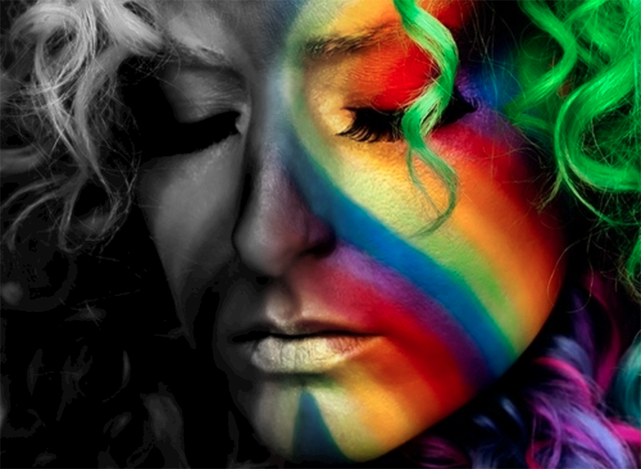

```
<svg width="500" height="366">

  <!-- We’re going to use the image twice, so let’s   make it a repeatable <symbol> -->
  <symbol id="image">
    <image x="0" y="0" width="500" height="366"     xlink:href="https://s3-us-west-2.amazonaws     .com/s.cdpn.io/3/rainbow-face.jpg"></image>
  </symbol>

  <!-- A filter we can use to grayscale whatever -->
  <filter id="grayscale">
    <feColorMatrix type="saturate" values="0" />
  </filter>

  <!-- A black-to-white gradient mask that we can   apply to whatever -->
  <mask maskUnits="userSpaceOnUse" id="fade">
    <linearGradient id="gradient" x1="0" y1="0"     x2="100%" y2="0">
      <stop offset="0" style="stop-color: #FFFFFF" />
      <stop offset="0.4" style="stop-color: #FFFFFF" />
      <stop offset="0.6" style="stop-color: #000000" />
      <stop offset="1" style="stop-color: #000000" />
    </linearGradient>
    <rect fill="url(#gradient)" width="100%" height="100%" />
  </mask>

  <!-- Place the image once, in full color -->
  <use xlink:href="#image"></use>

  <!-- Place the image again, on top, both   grayscaling it and masking it -->
  <use xlink:href="#image" filter="url(#grayscale)"   mask="url(#fade)"></use>

</svg>
```

Things really get fun when you combine these design features—you can even apply filters to patterns (FIG 8.24)!


And I could go on forever. With SVG, design effects can be combined and recombined infinitely. But I’ll force myself to stop here—now it’s your turn to build on the foundation I’ve sketched out.

What I’ve tried to do is introduce you to a bunch of possibilities, so that the next time you’re all, "I wonder if I could make a graphic of Susan Kare skateboarding through the screen of an old Macintosh icon shooting a laser beam at a hamburger icon and it blows up into a big rainbow,” your brain will be like: “I got some ideas.”
